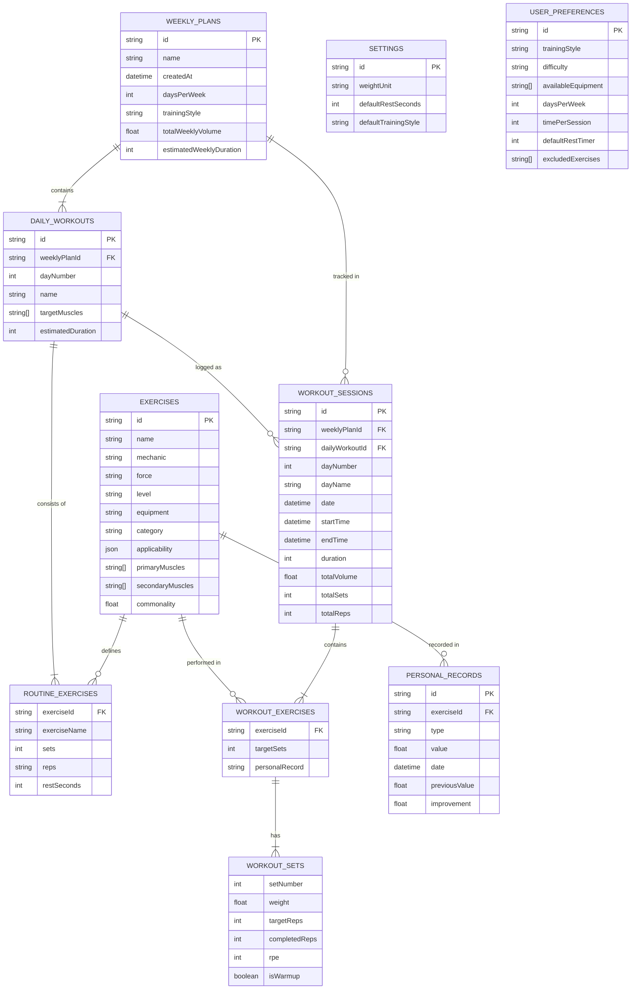

# Workout App — ER Diagram

```mermaid
erDiagram
    EXERCISES ||--o{ ROUTINE_EXERCISES : "defines"
    WEEKLY_PLANS ||--|{ DAILY_WORKOUTS : "contains"
    DAILY_WORKOUTS ||--|{ ROUTINE_EXERCISES : "consists of"
    WEEKLY_PLANS ||--o{ WORKOUT_SESSIONS : "tracked in"
    DAILY_WORKOUTS ||--o{ WORKOUT_SESSIONS : "logged as"
    WORKOUT_SESSIONS ||--|{ WORKOUT_EXERCISES : "contains"
    WORKOUT_EXERCISES ||--|{ WORKOUT_SETS : "has"
    EXERCISES ||--o{ WORKOUT_EXERCISES : "performed in"
    EXERCISES ||--o{ PERSONAL_RECORDS : "recorded in"

    EXERCISES {
        string id PK
        string name
        string mechanic
        string force
        string level
        string equipment
        string category
        json applicability
        string[] primaryMuscles
        string[] secondaryMuscles
        float commonality
    }

    WEEKLY_PLANS {
        string id PK
        string name
        datetime createdAt
        int daysPerWeek
        string trainingStyle
        float totalWeeklyVolume
        int estimatedWeeklyDuration
    }

    DAILY_WORKOUTS {
        string id PK
        string weeklyPlanId FK
        int dayNumber
        string name
        string[] targetMuscles
        int estimatedDuration
    }

    ROUTINE_EXERCISES {
        string exerciseId FK
        string exerciseName
        int sets
        string reps
        int restSeconds
    }

    WORKOUT_SESSIONS {
        string id PK
        string weeklyPlanId FK
        string dailyWorkoutId FK
        int dayNumber
        string dayName
        datetime date
        datetime startTime
        datetime endTime
        int duration
        float totalVolume
        int totalSets
        int totalReps
    }

    WORKOUT_EXERCISES {
        string exerciseId FK
        int targetSets
        string personalRecord
    }

    WORKOUT_SETS {
        int setNumber
        float weight
        int targetReps
        int completedReps
        int rpe
        boolean isWarmup
    }

    PERSONAL_RECORDS {
        string id PK
        string exerciseId FK
        string type
        float value
        datetime date
        float previousValue
        float improvement
    }

    SETTINGS {
        string id PK
        string weightUnit
        int defaultRestSeconds
        string defaultTrainingStyle
    }

    USER_PREFERENCES {
        string id PK
        string trainingStyle
        string difficulty
        string[] availableEquipment
        int daysPerWeek
        int timePerSession
        int defaultRestTimer
        string[] excludedExercises
    }
```
